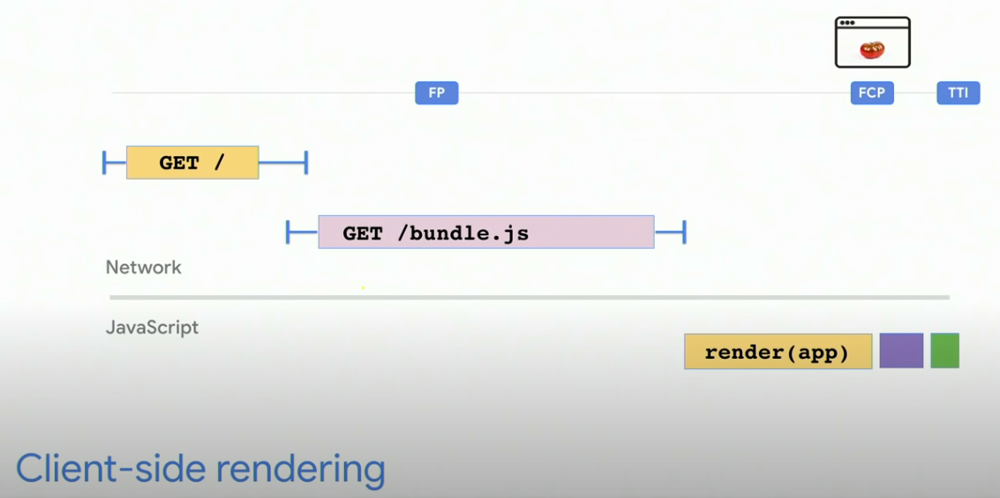
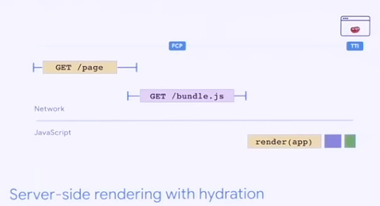
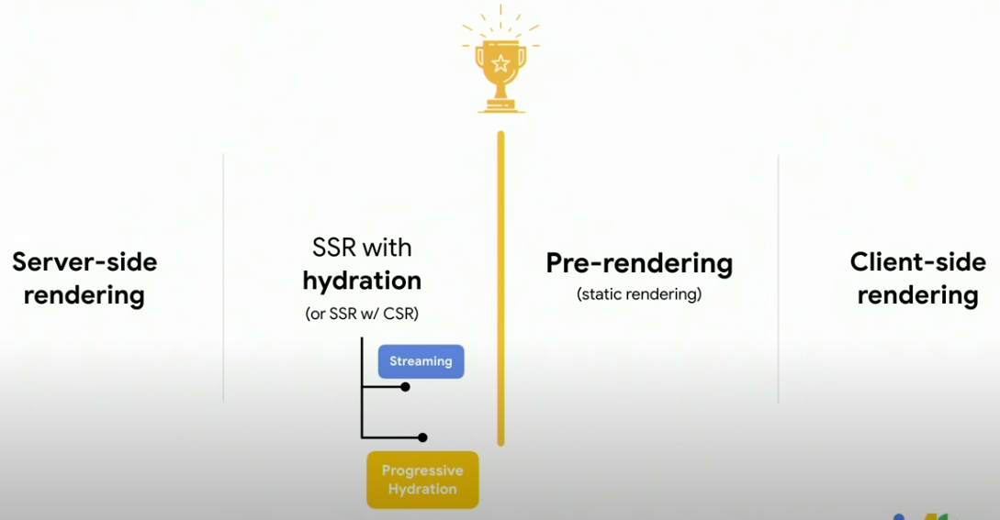
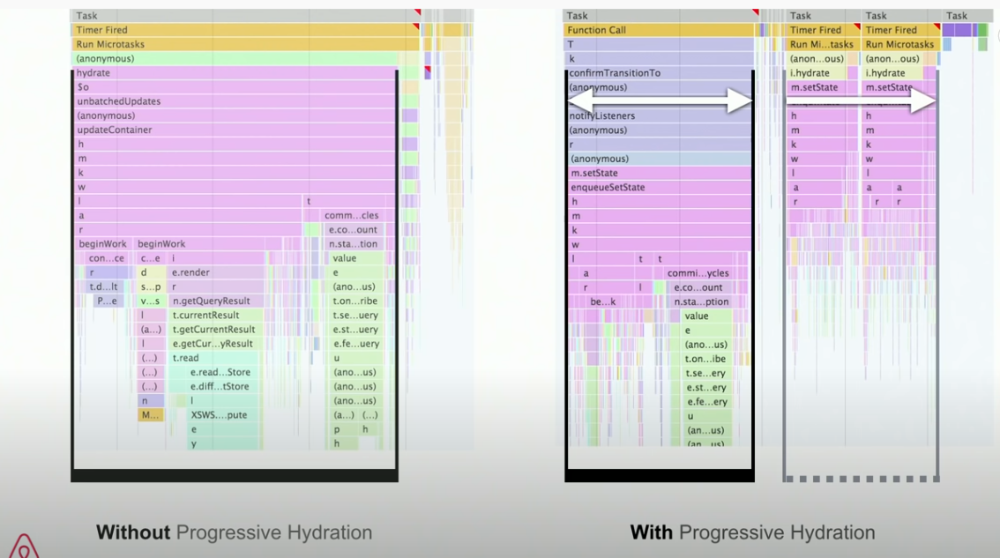

> 이 글은 **Web at Google I/O 2019** 의 
[*Rendering on the Web: Performance Implications of Application Architecture*](https://youtu.be/k-A2VfuUROg)
세션을 듣고 정리한 글입니다.

Web application의 Architecture는 Component model, Routing and Transtion, Data/state Management 등도 고려해야 하지만,
이 세션은 **Rendering and loading**에 초점을 맞췄다.

## The cost of rendering

용량이 큰 Javascript SPA를 브라우저에서 rendering한다고 가정하자.
가장 먼저, HTML skeleton을 받고 포함된 js를 실행하는 동안 rendering이 block된다.
마침내 Javascript를 통해 DOM들이 생성되며 완전한 web page를 그리게 된다.

브라우저가 HTML을 skeleton을 받으면 First Paint는 발생하지만, 
main Javascript 파일을 실행한 뒤 DOM을 완전히 생성해야지만 First Contentful Paint가 발생하는 것이다.
일정시간 뒤에 web page가 비로소 유저 interaction을 받을 수 있게 된다.(TTI, Time to Interactive)

문제는 Javascript bundle 파일의 용량이 비대해질 수록 FP부터 FCP까지 걸리는 시간이 늘어난다는 점이다.
즉 사용자는 web app을 로딩하는데 오래 기다려야하고 Performance와 User experience에서 그만큼 손해를 보게 된다.

## Back to basic

Client Side Rendering을 하는 Javascript SPA의 bundle 용량이 커짐에 따라 문제가 발생하는데, 
전통적인 방법처럼 Server Side Rendering을 하면 어떨까?

SSR은 브라우저가 HTML 파일을 parsing 하자마자 FCP를 보여줄 수 있을테니까 CSR의 문제를 해결할 수 있을 것 같다!
Performance에서 장점을 얻을 수는 있지만 CSR 같이 user interactive한 application을 만드는 데는 어려움이 있다.
SSR의 성능과 CSR의 interaction 두 마리 토끼를 잡을 방법은 없을까? (인간의 욕심은 끝이없다🤔)

## Server Sider Rendering with (full) hydration

최근 Javascript framework들은 Server Sider Rendering with hydration 방식을 지원한다.
React의 경우는 nodeJS server에서 `ReactDOMServer`의 `renderToString` method를 사용해서 구현할 수 있다.
또한, Next.js, Nuxt.js 같은 meta framework를 사용하면 간단한 설정으로 SSR with hydration을 적용할 수 있다.

SSR with hydration에서는 HTML을 파싱하자마자 화면을 보여줄 수 있기 때문에 FCP까지 시간이 적게 걸린다.
그러나 여전히 bundle js 파일없이는 Application이 interactive 하지 않다.
그렇기 때문에 FCP부터 TTI까지 시간을 단축해야 한다는 과제를 여전히 안고 있다.

## Rendering as a spectrum

Rendering Architecture들을 하나의 축 위에 올려두고 살펴보자.
가장 왼쪽이 thin client rendering, 가장 오른쪽이 thick client rendering이라고 하자.

Performance 측면에서 궁극적으로 우리가 원하는 것은, 
initial content를 빨리 client에 보내주고 사용자가 interaction 할 때 까지 대기하는 시간은 줄이는 것이다.

#### Prerendering

Prerendering은 Server에 build된 HTML파일을 가지고 있다가, client로부터 request가 왔을 때 즉시 보내준다.
이는 기존 SSR에서 request가 왔을 때, HTML을 generate하는 방식과는 대비된다.

First Contentful Paint에서 우위가 있으며 SSR overhead가 적다는 장점이 있다.
이 블로그를 작성하고 있는 Gatsby가 예시 중 하나다.
블로그에 쓰이는 것에서 유추할 수 있듯이 static한 content를 serve하는데는 문제가 없지만,
user interaction에 의해 동적으로 변하는 page를 제공하는 데는 한계가 있다.

#### Streaming

- multiple request를 한 번에 render
- chunk가 생성되자마자 다운받을 수 있음
- 전체 HTML이 생성될 때까지 기다릴 필요없음
- Time to Frist Byte(FFTB) 개선

다음으로 Streaming은 multiple request를 한 번에 render하는 방식으로
server 측에서 요청에 대한 chunk를 만들면 즉시 Client로 전송해준다.
페이지 전체의 HTML string이 생성될 때까지 기다리지 않아도 되기 때문에
Time to First Byte(FFTB)를 개선할 수 있다.
React에서는 `ReactDOMServer`의 `renderToNodeString`메소드를 이용하면 구현할 수 있다.

그러나 streaming이 silver bullet이 될 수는 없다.
Conference 현재, page가 적당히 크지 않으면(16kB) 성능의 향상을 느끼기 어렵다고 한다.

#### Progressive hydration

Code splitting을 사용해 페이지를 의미있는 컴포넌트 경계로 나누고 우선순위를 부여해 server에서 chunk를 전송한다.
SSR with full hydration과 비교했을 때,
페이지의 부분부분을 미리 정의해둔 우선순위에 따라 hydration을 시키기 때문에
그 부분의 chunk가 다운로드 됨에 따라 interactive 해진다는 점에서 차이가 있다.
사용자가 주로 사용하는 컴포넌트의 우선순위를 높게 해둔다면 User experience를 크게 향상시킬 수 있다.
필요에 따라 페이지 전체의 chunk를 hydrate하지 않고 지연시켰다가
lazy loading 기법등으로 사용자가 요청할 때 interactive하게 만들 수 있다.

React팀에서는 [Suspence roadmap](https://reactjs.org/docs/concurrent-mode-suspense.html)을 
통해 이를 도입하려고 노력중이다.
React에서 공식적으로 반영되지는 않았지만, 
community에서 공유되고 있는 방법으로 Progressive Hydration 구현이 가능하다.

Airbnb에서 Progressive Hydration을 적용했고, 아래와 같이 TTI를 개선한 것을 입증하기도 했다.

## Conclusion

그동안 Web application의 Rendering에 대해 공부하면서 CSR, SSR의 각각의 특징만 단편적으로 공부했었다.
양쪽의 장점을 취합해서 더 좋은 방법을 고안해내는 이야기를 들으며 software가 발전하게 되는 단계에 대해 고민해보는 기회가 되었다.

기존 CSR, SSR을 통해 구현했던 application들을 streaming 또는 progressive hydration을 도입해보고
얼마나 성능을 개선을 얻을 수 있는지, 그 과정에서 잃는 점은 없는지 확인해봐야겠다.

## Reference

[*Rendering on the Web: Performance Implications of Application Architecture*](https://youtu.be/k-A2VfuUROg)
