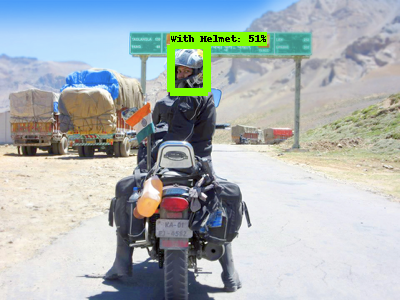

> How I deployed 'Helmet Detection' model with React Native application

The problem I wanted to solve was to check whether person wearing helmet with mobile application.
In here, I used Bikes Helmet Dataset and SSD MobileNet v2 320x320 model(provided by Tensorflow Object Detection API).
First, I trained the model in Python using Google Colab,
then developed an mobile application with react-native which can inference real-time.

## Defining the task

What I wanted to do with this application was to classify the images by if people wearing bike helmet or not.
It could be achieved by several different approaches.
For example, binary classification can be used to classify the image(wearing a helmet or not)
when we have raw pixel image as input and label of each image.
We could get to the goal with object detection as well.

Since this project has begun with my personal curiosity,
I didn't want to spend too much time on gathering and cleaning dataset.
I would rather wanted to find prepared dataset which is good to go.
So here, I decided to choose the approach depending on which dataset I could be available of.

After few hours of googling, luckily, I could find the 'Bikes Helmet Dataset' out.
It includes 764 images and annotations in PascalVOC format.
Accordingly, I decided to solve this problem by object detection approach.

## Data preparation

The 'Bikes Helmet Dataset' includes 764 images and annotations in PascalVOC format.
The below is how annotation file looks like.

```xml
<annotation>
    <folder>images</folder>
    <filename>BikesHelmets620.png</filename>
    <size>
        <width>400</width>
        <height>255</height>
        <depth>3</depth>
    </size>
    <segmented>0</segmented>
    <object>
        <name>With Helmet</name>
        <pose>Unspecified</pose>
        <truncated>0</truncated>
        <occluded>0</occluded>
        <difficult>0</difficult>
        <bndbox>
            <xmin>195</xmin>
            <ymin>42</ymin>
            <xmax>215</xmax>
            <ymax>70</ymax>
        </bndbox>
    </object>
    <object>
        <!-- ... -->
    </object>
    <object>
        <!-- ... -->
    </object>
</annotation>
```

Next thing what we need to do is parsing the annotation xml file and generating csv file with label information.
(plus, splitting the training and test set)
The csv file looks like below.
Width and height column means the size of image and xmin, xmax, ymin, ymax columns represents the bounding box of detected object.


## Training and Validating

#### Choosing the model

When it comes to training the model, I followed steps described in [Tensorflow Blog](https://blog.tensorflow.org/2021/01/custom-object-detection-in-browser.html).
I wanted to save my time on implementing object detection model on my own.
(And the performance of those models already have been proved!)

The reason I choose _SSD MobileNet v2 320x320_ model is quite similar as the blog post.
I don't need high accuracy but fast speed and small size in order to run it on mobile application.
Among the [TF2 model zoo](https://github.com/tensorflow/models/blob/master/research/object_detection/g3doc/tf2_detection_zoo.md),
I found that _SSD MobileNet v2_ meets my requirements.

#### Importing the dataset

Bikes Helmet dataset can be accessed with kaggle cli.
[Here](https://www.kaggle.com/andrewmvd/helmet-detection) is the link to the dataset.
It is much faster to download the dataset with kaggle-cli than upload the dataset in local using google colab filesystem.

Labelmap file is used for defining the classes that are going to be used.
And the labelmap for our model looks like below.

```pbtxt
item {
  name: "With Helmet"
  id: 1
}

item {
  name: 'Without Helmet'
  id: 2
}
```

#### Configuring the training

To speed up the training process, i used the technique so called transfer learning.
First download the weights of pre-trained model and use it for initializing.

Before configuring the training, reading MobileNetV2 [paper](https://arxiv.org/abs/1801.04381) and watching [recap youtube clip](https://www.youtube.com/watch?v=7UoOFKcyIvM&t=1415s&ab_channel=JinWonLee)
helped me to get the concept of the model.
I followed most of hyperparameters setting on blog post excepts the number of classes and the number of steps.

```python
num_classes = 2
batch_size = 96
num_steps = 5000
num_eval_steps = 1000
```

It took around 3 hours to get training done(in Colab GPU runtime environment).
It could take longer or shorter depending on the number of classes, number of steps or other hyperparameters.
According to classification loss graph provided by tensorboard, the classification loss has converged as training steps goes on.
This loss indicates whether bounding box class matches with the predicted class.

#### Validation

Following is the result of validation of the trained model using test set.

```bash
Average Precision  (AP) @[ IoU=0.50:0.95 | area=   all | maxDets=100 ] = 0.319
Average Precision  (AP) @[ IoU=0.50      | area=   all | maxDets=100 ] = 0.670
Average Precision  (AP) @[ IoU=0.75      | area=   all | maxDets=100 ] = 0.240
Average Precision  (AP) @[ IoU=0.50:0.95 | area= small | maxDets=100 ] = 0.032
Average Precision  (AP) @[ IoU=0.50:0.95 | area=medium | maxDets=100 ] = 0.419
Average Precision  (AP) @[ IoU=0.50:0.95 | area= large | maxDets=100 ] = 0.303
Average Recall     (AR) @[ IoU=0.50:0.95 | area=   all | maxDets=  1 ] = 0.274
Average Recall     (AR) @[ IoU=0.50:0.95 | area=   all | maxDets= 10 ] = 0.440
Average Recall     (AR) @[ IoU=0.50:0.95 | area=   all | maxDets=100 ] = 0.468
Average Recall     (AR) @[ IoU=0.50:0.95 | area= small | maxDets=100 ] = 0.189
Average Recall     (AR) @[ IoU=0.50:0.95 | area=medium | maxDets=100 ] = 0.559
Average Recall     (AR) @[ IoU=0.50:0.95 | area= large | maxDets=100 ] = 0.433

Loss/localization_loss: 0.261929 INFO:tensorflow:	+ Loss/classification_loss: 0.380425
Loss/classification_loss: 0.380425 INFO:tensorflow:	+ Loss/regularization_loss: 0.359017
Loss/regularization_loss: 0.359017 INFO:tensorflow:	+ Loss/total_loss: 1.001371
Loss/total_loss: 1.001371
```

Basically, there are two metrics which indicates performance of the model.

The recall(a.k.a sensitivity, true positive rate) is defines as ratio of true positive to total number of ground truth positive,
while the precision is defined as ratio of true positive to total number of predicted positive.

In this task, each case could be described as below.

- True Positive: A person is wearing a helmet, model detects a person with a helmet
- True Negative: A person is not wearing a helmet, model detects a person without a helmet
- False Positive: A person is not wearing a helmet, model detects a person with a helmet
- False Negative: A person is wearing a helmet, model detects a person without a helmet

IoU, which stands for Intersection of Union is given by the ratio of the area of intersection and area of union of the predicted bounding box and ground truth bounding box.


By Comparing mAP of our model(0.319) to it of SSD MobileNet v2 320x320(0.202) provided by TensorFlow 2 Detection Model Zoo, the model seems to be trained well.

```bash
Average Precision  (AP) @[ IoU=0.50:0.95 | area=   all | maxDets=100 ] = 0.319
Average Precision  (AP) @[ IoU=0.50      | area=   all | maxDets=100 ] = 0.670
Average Precision  (AP) @[ IoU=0.75      | area=   all | maxDets=100 ] = 0.240
```

The Average Recall(AR) was split by the max number of detection per image (1, 10, 100). The recall is 27.4% when there is only one person with helmet per image. However, when there are 100 people, the recall goes up to 46.8%.

```bash
Average Recall     (AR) @[ IoU=0.50:0.95 | area=   all | maxDets=  1 ] = 0.274
Average Recall     (AR) @[ IoU=0.50:0.95 | area=   all | maxDets= 10 ] = 0.440
Average Recall     (AR) @[ IoU=0.50:0.95 | area=   all | maxDets=100 ] = 0.468
```

#### Inference test images

To check if the model inferences appropriately, I customized [inferenceutil file](https://github.com/hugozanini/object-detection/blob/master/inferenceutils.py) from the blog post. Since file extension of our image data is png, I needed to convert 4 layers(RGB and transparency) into 3 layers(RGB).

```python
def load_image_into_numpy_array(path):
  img_data = tf.io.gfile.GFile(path, 'rb').read()
  image = Image.open(BytesIO(img_data))
  (im_width, im_height) = image.size
	image_np_array = np.array(image.getdata())
  return image_np_array[...,:3].reshape(
      (im_height, im_width, 3)).astype(np.uint8)
```





## Deploying real-time inference application

#### Converting the model

Thanks to [tensorflow.js converter](https://github.com/tensorflow/tfjs/tree/master/tfjs-converter),
we can convert trained model into JSON format(+ weights file in binary format).
I converted it in local rather than on colab environment.

```bash
$ pip install tensorflowjs[wizard]
$ tensorflowjs_converter \
    --input_format=tf_saved_model \
    --output_format=tfjs_graph_model \
    --signature_name=serving_default \
    --saved_model_tags=serve \
    saved_model \
    web_model
```

While they used Tensorflow wizard to convert the model in the blog post, I used CLI command.
The converted model from Tensorflow wizard caused error when I tried to inference on Application.

After successful conversion, you can the model.json file which has meta data of trained model.
You might have folder structured like below.

```
web_model
|_ model.json
|_ group1-shard1of5.bin
|_ group1-shard2of5.bin
|_ group1-shard3of5.bin
|_ group1-shard4of5.bin
|_ group1-shard5of5.bin
```

#### Time to write some code

Now we are ready to develop a react-native application which can inference the image on device.
(Entire code for the application is available in my [github repository](https://github.com/Pigrabbit/rn-object-detection))

First of all, [create React Native application](https://reactnative.dev/blog/2017/03/13/introducing-create-react-native-app),
and place converted model in the `assets/` directory.

We need few tensorflow packages in order to load model and inference.
Be careful, there are lots of dependencies to configure.
Follow guide on [tfjs-react-native](https://www.npmjs.com/package/@tensorflow/tfjs-react-native).
After configuration, open your editor and let's write some code.

Using IIFE(Immediately Invoked Function Expression), we are going to load the model to application as following code.

```tsx
// App.tsx
import { loadGraphModel } from "@tensorflow/tfjs";
import {
  bundleResourceIO,
  fetch,
  decodeJpeg,
} from "@tensorflow/tfjs-react-native";

let MODEL: unknown = null;

const modelJSON = require("./assets/web_model/model.json");
const modelWeights = [
  require("./assets/web_model/group1-shard1of5.bin"),
  require("./assets/web_model/group1-shard2of5.bin"),
  require("./assets/web_model/group1-shard3of5.bin"),
  require("./assets/web_model/group1-shard4of5.bin"),
  require("./assets/web_model/group1-shard5of5.bin"),
];

(async () => {
  try {
    await tf.ready();
    MODEL = await loadGraphModel(bundleResourceIO(modelJSON, modelWeights));
  } catch (error) {
    console.error(error);
  }
})();
```

I used [react-native-camera](https://github.com/react-native-camera/react-native-camera) library to take photo to inference.
`App` component renders camera view before taking a photo.
After taking a photo, it replace camera view with image view.
If objects detected in the image after inference, it will render detection box over the image.

```tsx
import { RNCamera } from 'react-native-camera';

const App = () => {
	// ...
	return (
		<>
      <StatusBar barStyle="dark-content" />
      <SafeAreaView style={styles.container}>
				<Header />
				<View>
					{imageUri === null && (
            <View style={styles.cameraContainer}>
              <RNCamera
                ref={cameraRef}
                ratio={'1:1'}
                style={{width: imageWidth, height: imageWidth}}
                onCameraReady={() => setIsReadyToCapture(true)}
								...
              />
            </View>
          )}
					{imageUri !== null && (
            <View style={styles.imageContainer}>
              {detectionObjects &&
                detectionObjects.map((obj, idx) => (
                  <DetectedBox
                    key={idx}
                    x={obj.bbox[0]}
                    y={obj.bbox[1]}
                    width={obj.bbox[2]}
                    height={obj.bbox[3]}
                    score={obj.score}
                  />
                ))}
              <Image source={{uri: imageUri}} style={styles.image} />
            </View>
          )}
				</View>
				<View style={styles.controlPanel}>
          <View style={styles.buttonList}>
						<Button title={'refresh'} ... />
						<Button title={'shoot'} ... />
						<Button title={'infer'} ... />
					</View>
        </View>
			</SafeAreaView>
    </>
  )
}
```

The component manages prediction result and detection objects as state.
Prediction result is data of boxes, scored and classes from the output of inference.
Detection objects are processed object in order to render bounding box and score on the image.

```tsx
const App = () => {
	const [predictedResult, setPredictedResult] = useState<{
    boxes: unknown;
    scores: unknown;
    classes: unknown;
  }>({boxes: null, scores: null, classes: null});
  const [detectionObjects, setDetectionObjects] = useState<
    {
      bbox: number[];
      class: number;
      label: string;
      score: string;
    }[]
  >([]);

	// ...

	return (
		// ...
	)
}
```

Last but not least, here is how we do inference on react native application.
When user press **infer** button, it converts taken photo into tensor(using `fetch`, `decodeJpeg` from tfjs-react-native).
Then this tensor passed into `inference()` function which executes inferencing.
The output of inference is stored in component as state(`predictionResult`).
When the prediction result changed, it generates detection objects which will be used in rendering bounding box.

```tsx
const imageWidth = Dimensions.get("window").width;
const threshold = 0.5;

const App = () => {
  // ...

  const inference = useCallback(async (imageTensor: tf.Tensor3D) => {
    if (!imageTensor || isInferencing) return;
    try {
      const predictions: tf.Tensor<tf.Rank>[] = await MODEL.executeAsync(
        imageTensor.transpose([0, 1, 2]).expandDims()
      );
      const boxes = predictions[5].arraySync();
      const scores = predictions[4].arraySync();
      const classes = predictions[2].dataSync();

      setPredictedResult({ boxes, scores, classes });
    } catch (error) {
      console.error(error);
    }
  }, []);

  useEffect(() => {
    if (!predictedResult || !predictedResult.scores) return;

    const { boxes, scores, classes } = predictedResult;
    const currentDetectionObjects = [];

    scores[0].forEach((score, idx) => {
      if (score > threshold) {
        const bbox = [];
        const minY = boxes[0][idx][0] * imageWidth;
        const minX = boxes[0][idx][1] * imageWidth;
        const maxY = boxes[0][idx][2] * imageWidth;
        const maxX = boxes[0][idx][3] * imageWidth;
        bbox[0] = minX;
        bbox[1] = minY;
        bbox[2] = maxX - minX;
        bbox[3] = maxY - minY;

        currentDetectionObjects.push({
          class: classes[idx],
          label: classesDir[classes[idx]].name,
          score: score.toFixed(4),
          bbox: bbox,
        });
      }
    });

    setDetectionObjects(currentDetectionObjects);
  }, [predictedResult]);

  return (
    // ...
    <Button
      title={"infer"}
      onPress={async () => {
        const response = await fetch(imageUri, {}, { isBinary: true });
        const imageDataArrayBuffer = await response.arrayBuffer();
        const imageData = new Uint8Array(imageDataArrayBuffer);
        const imageTensor = decodeJpeg(imageData);
        await inference(imageTensor);
      }}
    />
  );
};
```

It's all set, let's build the application and launch it.
how some images and let it work!

After numerous steps, we could eventually check if person wearing a bike helmet with react native application!


Entire code for the application is available in my [github repository](https://github.com/Pigrabbit/rn-object-detection)

## Conclusion

You might be disappointed with recall and precision of this model.
However, what's interesting here is that we achieved client side inferencing even with cross-platfrom mobile application.
It means our model is small and fast enough to run on mobile device.
Quite awesome, isn't it?

I have done couple of deep learning projects but it was the first time I deployed the model.
Personally, I think deep learning models get more value when they are used in various products(web or mobile application).

All above steps were only quick prototyping, so hyper parameter tuning and other experiments are lefts to make this model (and application) better.

## Reference

[Custom object detection in the browser using TensorFlow.js](https://blog.tensorflow.org/2021/01/custom-object-detection-in-browser.html)

[TensorFlow js Model Zoo](https://github.com/tensorflow/models/blob/master/research/object_detection/g3doc/tf2_detection_zoo.md)

[Breaking down Mean Average Precision (mAP)](https://towardsdatascience.com/breaking-down-mean-average-precision-map-ae462f623a52)

[TensorFlow.js for React Native is here!](https://blog.tensorflow.org/2020/02/tensorflowjs-for-react-native-is-here.html)
