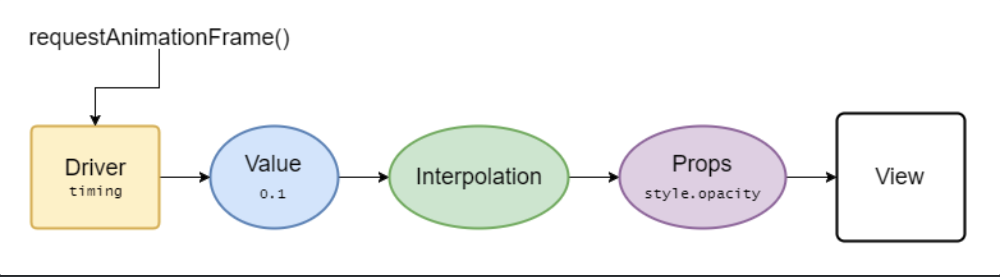

> 이 글에서는 React Native의 animation 동작 원리 및 Animated API에 대해 이야기합니다.

client application에서 일반적으로 state value를 변경함으로써 UI를 업데이트 합니다.
이 때 UI 구성에 따라 사용자는 깜빡임을 느낄 수 있는데 이는 사용자 경험에 부정적인 영향을 줍니다.
급격한 레이아웃 변화 대신 애니메이션을 이용해 부드럽게 전환시키면 사용자 경험을 크게 해치지 않으면서 UI를 업데이트 할 수 있습니다.

### How React Native animation works

React Native는 아래 그림과 같이 Javascript Driver를 사용해서 애니메이션을 구동합니다.

순서대로 보면,

- Javascript의 animation driver가 60 FPS로(16ms에 한 번씩) `requestAnimationFrame()`로 Animated Value를 계산하여 업데이트 해줍니다.
- Javascript에서 계산한 값을 각 Animated Value와 연결되어 있는 View 컴포넌트에 전달합니다
- Javascript에서 해당 View 컴포넌트의 props를 `setNativeProps`를 이용하여 업데이트합니다.
- Bridge를 이용해 Native로 이동
- Native(iOS, Android)의 `UIView`, `android.View`를 업데이트합니다.

이처럼 많은 작업이 Javascript 영역에서 이루어지는 것을 알 수 있습니다.

만약 Javascript main thread에 block이 생기면 어떻게 될까요? (main thread는 애니메이션 이외에도 network request, async storage access등 많은 작업을 수행합니다.)

정의한 Animation에 lag이 생기고 부드러운 화면 전환이라는 목표를 이루지 못하고 오히려 사용자 경험을 저해하게 됩니다. 사용자 경험을 향상을 위해 비용(시간과 노력)을 들여 코드를 작성했는데 오히려 저해한다니, 최악의 상황이네요.

그럼 main thread의 바쁨 정도에 영향을 안 받고 애니메이션을 실행하는 방법은 없을까요?

### Native driver

이를 해결하기 위해 등장한 것이 바로 native driver입니다.

Javascript 영역에서 animation 동작에 대해 정의하고 실행시킬 때, 그 정보를 serialize해서 native 영역으로 보내고 나면, 이후 매 frame 마다 화면을 업데이트 하는 일은 Javascript의 도움없이 native 영역에서 수행합니다. 이렇게 되면 main thread가 바쁘더라도 애니메이션은 부드럽게 실행시킬 수 있게 됩니다.

#### Limitation

하지만 안타깝게도 layout에 활용되는 속성(left, right, top, bottom, width, height 등)들은 native driver의 힘을 빌어 애니메이션을 실행시킬 수 없습니다.

이 때문에 레이아웃에 활용되는 속성보다는 `transform`과 `opacity` 을 변경시키는 방법으로 애니메이션을 구현하고 native driver로 프레임을 관리하게 하는 방법이 성능에 유리합니다. 하지만 이 두 가지 속성으로 도저히 구현하기 어려운 경우에는 [react-native-reanimated](https://github.com/software-mansion/react-native-reanimated)를 활용할 수 있습니다.

한편, Animated.event의 경우

- direct event(native에 직렬화된 정보를 전달하는 시점에, 어떤 view 컴포넌트가 이 이벤트를 처리해야 하는지 아는 경우)와
- bubble up되지 않는 event

에서만 native driver를 활용할 수 있습니다. 예를 들어 ScrollView의 onScroll에서는 사용가능하나, PanResponder에서는 사용할 수 없습니다.

이에 대한 해결책도 등장했는데 [react-native-gesture-handler](https://github.com/software-mansion/react-native-gesture-handler)가 바로 그것입니다.

### Animated API

React Native에서는 편리하게 애니메이션 동작을 정의하고, 실행시킬 수 있도록 Animated API를 제공합니다.

#### Flow

기본적으로 애니메이션을 선언하고 작동(실행, 중지)하는 순서는 아래와 같습니다.

1. Animated Value를 생성한다
   - Value는 하나(scalar) 또는 두 개(vector)의 number의 형태이다
   - 이 Value들은 `add(),` `subtract(), multiply(), divide(), modulo()`로 연산이 가능하다.
2. 애니메이션을 넣고자 하는 RN View 컴포넌트의 style property에 등록한다
3. `timing()` 등으로 원하는 애니메이션 동작을 설정한다
4. 애니메이션을 실행한다
   - start()로 실행 stop()으로 중지시키는 방법
   - RN 컴포넌트의 event handler에 연결시켜 시작 trigger를 주는 방법

#### Configuration

대부분의 경우 `timing()` 함수에 easing function을 이용해 애니메이션 동작을 설정할 것 입니다. 그러나 기본 easing function들로 나타낼 수 없는 애니메이션의 경우 `spring()` 또는 `decay()`를 이용해 설정할 수 있습니다. friction, tension, bounciness, speed, stiffness, damping, mass를 manual하게 설정할 수 있습니다.

#### Combination

유저의 인터랙션에 따라 한가지 다수의 컴포넌트가 자연스럽게 움직이고 싶을 때에는 애니메이션들을 그룹지어 실행시킬 수 있습니다.
`sequence()`, `parallel()` 을 이용하면 n개의 애니메이션을 순차적으로 실행시킬 수도, 동시에 병렬적으로 실행시킬 수도 있습니다. `delay()` 는 지연을 주고 애니메이션을 실행할 수 있도록 돕습니다.

### Experiment

> **JS thread가 바쁠 때 Native Driver 사용여부에 따라 애니메이션이 어떻게 보일까?**

동일한 애니메이션을 오렌지 색 공에는 native driver를 사용하지 않도록,
민트색 공에는 native driver를 사용하도록 걸어주었습니다.
버튼을 누름에 따라 useEffect hook에서 JS thread에서 연산을 수행하도록 설정해두었습니다.

<Gist gistLink="Pigrabbit/b940226c93e7de0045190c4d7634b691"/>

오렌지 색의 공은 첫 움직임에 lag이 발생하는 반면 민트색 공은 스무스하게 움직이는 것을 확인할 수 있습니다. (아래 영상의 perf monitor에서 JS FPS가 순간 40까지 떨어지는 것을 확인할 수 있습니다)

<YouTube youTubeId="tjkt7GshdOk" />

## Conclusion

React Native application의 UX를 향상시키기 위한 animation의 동작원리와 구현방법에 대해 이야기해봤습니다.
작동 원리와 애니메이션 성능을 개선하는 방법을 알게 되었으니 반복된 숙련을 통해 보다 나은 사용자 경험을 주는 application을 개발할 수 있도록 노력해야 하겠습니다.

## Reference

[React Native Animated API](https://reactnative.dev/docs/animated)

[Using Native Driver](https://reactnative.dev/docs/animations#using-the-native-driver)

[react-native-reanimated](https://github.com/software-mansion/react-native-reanimated)

[react-native-gesture-handler](https://github.com/software-mansion/react-native-gesture-handler)
