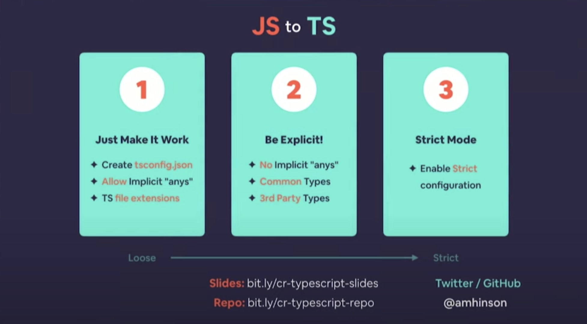

현재 진행중인 React 프로젝트가 Javascript로 되어있나요?
Application이 커질수록 **undefined** 나 **TypeError** 에게 고통받고 있지는 않나요?
다행히 문제가 없다면 아래 글을 읽을 필요는 없을 것 같네요.

그렇지만, 이들 때문에 디버깅에 많은 시간을 할애하고 개발속도가 느려지는 문제를 겪고 있다면
이 글을 읽고 한 번 고민해보면 좋을 것 같습니다.

## Why I came up with Typescript migration

프로젝트에 새로 투입되어 레거시 코드를 읽어가던 중 변수의 타입을 number로 변환하는 `parseInt()`를
반복적으로 쓰는 패턴을 발견했습니다.

함수가 parameter로 받은 것이 string 인지, number 인지 알 수가 없었고,
그로 인해 연산전에 항상 `parseInt()`를 이용해 변수를 정제하는 코드가 들어가 있었습니다.

뿐만 아니라 parameter로 전달받은 object의 form을 알지 못하기 때문에 항상 key가 있는지
null check를 하는 코드가 반복적으로 발견되었습니다.

React 컴포넌트의 경우, 부모로부터 어떤 data들을 props로 내려받는지,
컴포넌트의 고유 state는 어떤 type의 값인지 확인하기가 어려웠습니다.

이렇게 코드를 읽어내려가는데 어려움을 느끼자, Typescript를 적용해보면 이 상황을 조금 개선시킬 수 있지 않을까라는 생각이 들었습니다.

## How could Typescript improve your project(and codebase)?

타입스크립트는 흔히 발생하는 실수를 방지하며, 자신과 미래의 개발자들에게 문서화를 제공하고,
리팩터링을 쉽게 만들며, 단위 테스트의 숫자를 반으로 줄임으로 더 안전한 프로그램을 구현할 수 있게 보장합니다.

Javascript는 언어 특성상 실수가 있는 코드라도 최대한 실행하려 노력합니다.
이것이 고마울 때도 있지만 골치 아프게 하는 경우가 더 많습니다.
위에서 언급했던 `parseInt(string [, radix])`의 경우도 첫 인자가 string이 들어오지 않는 경우
`.toString()`을 이용하여 강제로 변환한 뒤 logic을 실행합니다.
명백하게 잘못된 동작임에도 Javascript는 Exception을 던지지 않고 어떻게든 결과를 만들어 냅니다.
이 때문에 개발자는 디버깅을 하기가 더욱 어려워지게 되죠.

Javascript가 프로그램을 실행할 때 개발자가 실수를 저질렀음을 알려주는 데 반해,
Typescript는 코드를 입력하는 순간마다 실수가 있다면 엄격하게 곧바로 에디터에 빨간 줄을 그어버립니다.
그 덕분에 개발자와 Application은 타입 관련 버그에서 해방될 수 있습니다.

## Consideration

제 아무리 Typescript가 많은 선물을 가져다 준다고 한들,
모든 Javascript 프로젝트를 지금 당장 Typescript로 전환해야 한다고 이야기 하는데는 무리가 있습니다.

우선 현재 프로젝트의 규모가 크지 않고 복잡성이 낫다면 당장 전환할 필요는 없다고 생각합니다.
Application에서 더 많은 API를 호출하고 다양한 reducer들이 상태를 관리하며
컴포넌트 구조가 더 복잡해진다면 그 때 도입을 검토해도 늦지 않다고 봅니다.

무엇보다 중요한 것은 Application을 함께 개발하는 동료의 의견을 묻는 것이라고 생각합니다.
Javascript가 능숙한 개발자에게 Typescript의 러닝 커브가 높지 않다고 생각하지만
개개인마다 차이가 있을 수 있으며, Typescript로 전환의 필요성에 대한 견해가 다를 수 있기 떄문이죠.
그렇기 때문에 꼭 동료의 의견을 충분히 묻고 마이그레이션 결정을 하면 좋을 것 같습니다.

## Migration Plan

Javascript 프로젝트에 단번에 Typescript로 migration하는 것은 어렵기 때문에
아래 그림과 같이 3단계로 나누어 진행하려고 계획을 세웠습니다.



현재는 1단계 작업을 진행하고 있으며 구체적으로 react application에서 아래와 같은 작업들을 추가적으로 진행하고 있습니다.

#### ban types 수정

기존 Javascript 프로젝트의 드문드문 타입이 정의된 곳이 있었습니다.
(Typescript가 아니기 때문에 type checking 등 장점을 온전히 누리지는 못하고 있었지만요.)

또한, Typescript를 충분히 익히고 사용한 것이 아니라 ban type들을 사용하는 부분이 많았습니다.
`string` 대신 `String`을 쓰고 있었고, 객체 또한 `object`로 객체가 어떤 fields를 가지고 있는지 묘사하지 못하고 있었습니다.
함수는 호출 시그니처 대신 `Function`을 사용하고 있어 parameter와 return value에 대해 충분히 정보를 전달하지 못하고 있었습니다.

이렇게 ban types이 쓰인 곳에 적절한 타이핑을 해주었습니다.

#### React Component의 props, state 타입 정의

React Component가 부모 component로부터 전달받는 props또한 타이핑이 되어있지 않았습니다.
자식 component에서 props를 destructuring 하여 사용하고 있지도 않아서 어떤 props를 내려받는지
부모 component를 tracking하며 각 변수의 타입을 조사했습니다.

React Class Component에서는 아래와 같이 generic을 이용해 타이핑을 해줄 수 있습니다.

```typescript
interface IButtonProps {
  title: string;
  onClick: () => void;
}

type ButtonState = {
  disabled: boolean;
};

class Button extends React.Component<IButtonProps, ButtonState> {
  // ...
}
```

한편 Function Component에서는 아래와 같이 타이핑을 할 수 있습니다.

```typescript
const Button: React.FC<IButtonProps> = ({ title, onClick }) => {
  // ...
};
```

#### API response에 타입 적용

다음으로 API response에 대해 타입을 적용했습니다.
Application에서 호출하는 API의 documentation이 충분하다면 크게 어렵지 않을 것 입니다.
운이 나쁘게도 문서화가 되어있지 않다면, HTTP response를 받는 부분에서 debugger를 이용해
response data를 조회해야 할 것 입니다.

#### 상태관리 reducers에 타입 적용

Application에서 API response를 reducer를 이용해 caching하고 있을 것 입니다.
위의 작업을 완료했다면 이 단계는 어렵지 않게 진행할 수 있습니다.

크게 reducer의 state, action에 대한 타입 정의가 필요합니다.
아래는 Toast 메시지를 노출하는 Toast component의 예입니다.

```typescript
// toast/types.ts
export type VerticalPosType = "TOP" | "MIDDLE" | "BOTTOM";
export type ToastMessageType = "CONFIRM" | "WARNING" | "ERROR";
export type ToastMetaData = {
  verticalPos: VerticalPosType;
  message: string;
  toastType: ToastMessageType;
  duration: number;
};

export const SHOW_TOAST_ACTION = "toast/show";
export interface ShowToastAction {
  type: typeof SHOW_TOAST_ACTION;
  payload: ToastMetaData;
}

export const CLEAR_TOAST_ACTION = "toast/clear";
export interface ClearToastAction {
  type: typeof CLEAR_TOAST_ACTION;
}

export type ToastAction = ShowToastAction | ClearToastAction;

// toast/actions.ts
export function showToast({
  verticalPos,
  message,
  toastType,
  duration,
}: ToastMetaData): ShowToastAction {
  return {
    type: SHOW_TOAST_ACTION,
    payload: {
      verticalPos,
      message,
      toastType,
      duration,
    },
  };
}

export function clearToast(): ClearToastAction {
  return {
    type: CLEAR_TOAST_ACTION,
  };
}

// toast/reducers.ts
export type ToastState = {
  isVisible: boolean;
} & ToastMetaData;

const initialToastState: ToastState = {
  isVisible: false,
  verticalPos: "TOP",
  toastType: "CONFIRM",
  message: "",
  duration: 0,
};

export function toastReducer(state = initialToastState, action: ToastAction) {
  switch (action.type) {
    case CLEAR_TOAST_ACTION:
      return {
        ...initialToastState,
        isVisible: false,
      };
    case SHOW_TOAST_ACTION:
      return {
        isVisible: true,
        ...action.payload,
      };
    default:
      return state;
  }
}
```

## Conclusion

프로젝트 규모에 따라 마이그레이션 작업이 길어지고 지루해 질 수 있습니다.
Typescript의 장점을 보고 시작한다하더라도 추진력을 잃기 쉽죠.

충분히 여유를 가지고 한걸음씩 안정적인 Javascript Application에 다가간다고 접근하는 편이 좋을 것 같습니다.
조금은 지루하고 번거로운 작업이지만 이 작업 뒤에는 안정적이고 더 빠르게 개발할 수 있는 어플리케이션으로 재탄생해 있을 것입니다.

## Reference

Programming TypeScript, Boris Cherny, May 2019, O'Reilly Media, Inc

[Convert a React Native Project to Typescript in 10 Minutes](https://www.youtube.com/watch?v=OdU9H-_d14Y&t=269s&ab_channel=CodingTech)

[React Typescript Cheatsheet](https://github.com/typescript-cheatsheets/react)

[Redux Usage with Typescript](https://redux.js.org/recipes/usage-with-typescript)
