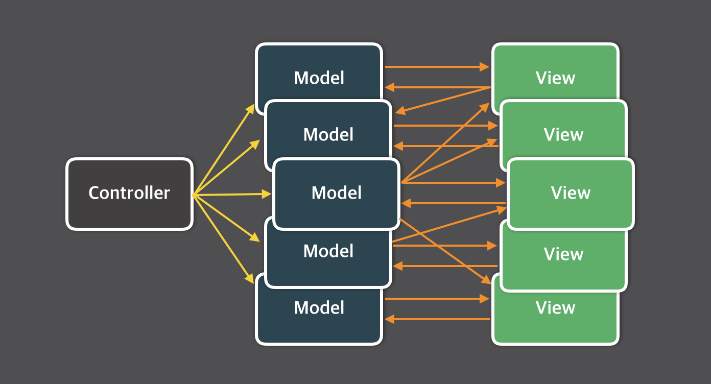

Frontend 개발에서 가장 흔한 interaction의 흐름은 event -> update state -> rerender 라고 할 수 있다.
즉, 사용자에 의해 event가 발생하고, 그 event에 따라 상태를 변경하며, 변경된 상태에 맞는 화면을 보여주어야 한다.

이런 흐름에서 가장 쉽게 떠올릴 수 있는 것이 MVC패턴이다.
Model과 View 사이에 Controller를 두어 그 둘의 결합을 느슨하게 하는 역할을 맡길 수 있다.

그러나, 관리해야 하는 state이 많아지면 Controller가 거대해 지고 Model들 사이의 관계가 뒤엉키게 되는 단점이 있다.

**Observer** (subscribe-publish) design pattern을 이용해 이 문제를 해결할 수 있을 것 같다.


## Observer pattern

Design Patterns: Elements of Reusable Object-Oriented Software
(*Erich Gamma, John Vlissides, Ralph Johnson, Richard Helm*)
에 따르면 **Observer pattern** 의 purpose와 use case는 아래와 같다.

#### Purpose

> 객체 사이에 1-N 의존 관계를 정의해 두어, 
어떤 객체의 state가 변할 때 그 객체에 의존성을 가진 다른 객체들이
그 변화를 통지받고 자동으로 update될 수 있게 만듭니다.

#### Use case

> - 어떤 추상 개념이 두 가지 양상을 갖고 하나가 다른 하나에 종속적일 때,
각 양상을 별도의 객체로 캡슐화하여 이들 각각을 재사용할 수 있다.
- 한 객체에 가해진 변경으로 다른 객체를 변경해야 하고, 
프로그래머들은 얼마나 많은 객체들이 변경되어야 하는지 몰라도 될 때
- 어떤 객체가 다른 객체에 자신의 변화를 통보할 수 있는데,
그 변화에 관심있어 하는 객체들이 누구인지에 대한 가정 없이도 그러한 통보가 될 때

Use case의 마지막 두 가지가 Frontend 개발에서 interaction 흐름을 제어하는데 꼭 들어맞는 것 같다.
이 pattern을 활용해 간단한 todo application을 구현해봤다.

## Todo application with Observer pattern

#### State, subscribe and publish

가장 먼저 state를 들고 있는 state 객체를 만들었다.
data에는 todo list에 들어갈 item들을 가지고 있고, 
listeners 객체는 이 todoList를 구독하고 있는 component와 action을 key, value로 가지고 있다.

```javascript
export const state = {
  todoList: {
    data: [],     // todo items
    listeners: {} // component: action
  }
}
```

다음으로 component가 state를 observe하도록 구독하는 `subscribe()` 함수를 구현했다.
앞으로 component를 생성할 때, 해당 component가 dependency가 있는 state를 `subscribe()` 하는 방식으로 사용한다.

```javascript
export const subscribe = (component, key, action) => {
  state[key].listeners[component] = action
};
```

그리고 state가 변경되었을 때, 
구독(observe)하고 있는 component(observer)들에게 변경을 알려주고
등록된 action을 실행시키는 `publish()` 함수를 구현했다.
뒤에서 다루겠지만, 이 예제에서 action으로는 각 component의 `render()` 함수를 등록했다.

`state` 객체의 `data`가 변경되었을 때 적절한 key로 이 `publish()` 함수를 호출하는 방식으로 사용한다.

```javascript
export const publish = (key) => {
  Object.values(key.listeners).forEach((action) => action(key.data));
}
```

#### Update state and let component update accordingly

앞에서 구현한 `subscribe()`, `publish()`와 더불어 state를 변경시키는 함수들을 몇 가지 추가로 구현했다.

```javascript
export const getTodoList = () => {
  return state.todoList.data;
};

export const addTodo = (newTodo) => {
  state.todoList.data = [...state.todoList.data, newTodo];
  publish(state.todoList);
};

export const removeTodo = (targetTodo) => {
  state.todoList.data = state.todoList.data.filter(
    (todo) => todo !== targetTodo
  );
  publish(state.todoList);
};
```

`getTodoList()`는 단순히 `state.todoList`의 data를 retrieve하는 함수이기 때문에 `publish()`를 호출하지 않는다.

반면, `addTodo()`, `removeTodo()`와 같이 data를 변경하는 함수들은 
마지막에 `publish()`함수를 통해 observe하고 있는 component들이 변경될 수 있도록 알려준다.

위의 함수들을 활용해 `TodoList`와 `TodoListInput` 컴포넌트를 아래와 같이 구현했다.

<iframe src="https://codesandbox.io/embed/serverless-tree-ozx6x?fontsize=14&hidenavigation=1&theme=dark"
  style="width:100%; height:500px; border:0; border-radius: 4px; overflow:hidden;"
  title="serverless-tree-ozx6x"
  allow="accelerometer; ambient-light-sensor; camera; encrypted-media; geolocation; gyroscope; hid; microphone; midi; payment; usb; vr; xr-spatial-tracking"
  sandbox="allow-forms allow-modals allow-popups allow-presentation allow-same-origin allow-scripts"
></iframe>

## Conclusion

결론적으로 Observer pattern을 활용함으로써 component(view)와 state(model)의 결합을 약화시킬 수 있었다.
model은 view의 구현을 알지 못해도 되며, 
각 state를 구독하고 있는 observer의 list를 들고있다가 
state의 변경만 알려주면 되었다.
구독하고 있던 component들은 변경에 대한 알림이 오면 그 알림을 처리(render)해주기만 하면 되었다.

Flux pattern 도 이런 design pattern과 관련이 있다고 들었다.
아직 상태 관리 library를 접해보지 못했지만, 그들을 이해하고 활용하는데 밑거름이 될 것 같다.


## Reference

Design Patterns: Elements of Reusable Object-Oriented Software, *Erich Gamma, John Vlissides, Ralph Johnson, Richard Helm*