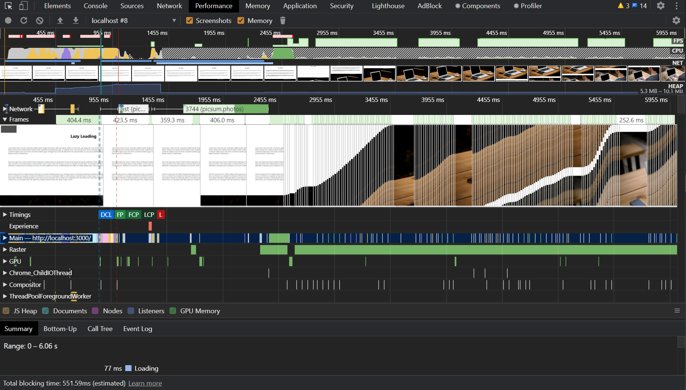

E-commerce, shopping mall 등 application을 개발하다보면 한 페이지에 수많은 image들이 삽입된다.
image가 사용자에게 상품을 보여주는 가장 보편적인 매체이기 때문이다. (미래에는 3D 영상, AR 영상으로 상품을 보여주지 않을까?)

web page에서 많은 image가 포함되면 그 source들을 가져오는데 그 만큼의 시간이 필요하고 web site의 성능은 떨어지게 된다.
특히, 고해상도 큰 용량의 image라면 더욱 치명적이다.

(Image lazy load를 이용한다면 이런 문제를 극복할 수 있을 것 같다)

## What the heck is image lazy loading? 

**Image Lazy Loading**이란 필요한 시점까지 image를 load하는 것을 지연시키는 것을 말한다.
반대되는 개념으로 **eager loading**이 있다. 

Web page에서 포함된 모든 image source들을 처음 loaidng되는 시점에 모두 load하는 것이 **eager loading** 이라면,
사용자가 페이지의 특정 부분을 볼 때(사용할 때), 그 곳에 필요한 image source를 load 하는 것을 **lazy loading** 이라고 한다.

**eager loading** 방법을 사용할 때, web page에 image source들이 많다면 전체 page를 load하는데 시간이 오래 걸린다.
또한, load된 뒤에도 연속적으로 Network 요청을 하게되고 브라우저에서 reflow를 일으키게 된다.

반면 **lazy loading** 방법을 이용하면 page load하는 시간도 단축시킬 수 있고 브라우저 reflow를 적게 일으켜 
web site의 전반적인 performance와 UX를 향상시킬 수 있다.

## Implementation

Web API의 **Intersection Observer** API를 사용해 image lazy loading을 구현해봤다.
(구현에 필요한 image들은 [Lorem Picsum](https://picsum.photos/) API를 이용했다)
기본적인 concept은 아래와 같다.

> - Viewport를 이용해 사용자가 보고 있는 web page의 위치를 확인한다
- image의 src url을 `data-lazy` attribute에 숨겨두었다가
- 사용자가 보는 시점에, 그 위치에 `data-lazy`의 src url을 `src` 로 옮겨 필요한 image를 lazy load한다.

가장 먼저 `useEffect()` hook에서 API를 호출해 필요한 image 들의 src url을 받아온다.
(Lorem Picsum의 API를 이용하면 30장의 image list를 받을 수 있다.)

```javascript
export default function ImageList() {
  const [imageSrcList, setImageSrcList] = useState([]);
  const imageRefList = useRef([]);

  useEffect(() => {
    async function fetchData() {
      const data = await fetch(API_ENDPOINT, { method: "GET" });
      const result = await data.json();
      setImageSrcList(result.map((image) => image.download_url));
    }

    fetchData();
  }, []);
  // ...
}
```

다음으로 `img` element들을 Intersection Observer로 observe 한다.
`IntersectionObserver` 객체를 생성할 때, handler callback 함수와 options 객체를 parameter로 전달한다.
이때 handler callback 에서 위에서 언급했던 `data-lazy`에 있던 src url을 `src` attribute으로 넣어주는 로직을 구현하면 된다.
`options` 객체에서는 root element, threshold, rootMargin 등을 설정할 수 있다.

```javascript
export default function ImageList() {
  //...
  useEffect(() => {
    const observeHandler = (entries, observer) => {
      entries.forEach((entry) => {
        if (!entry.isIntersecting) return
        entry.target.src = entry.target.dataset.lazy;
        observer.unobserve(entry.target);
      });
    };

    const options = {
      root: null,
      threshold: 0,
      rootMargin: "-30% 0px 0px 0px",
    };

    const observer = new IntersectionObserver(observeHandler, options);

    imageRefList.current.forEach((imageRef, idx) => {
      observer.observe(imageRef);
    });
  }, [imageSrcList]);
  //...
}
```

이와 같이 Intersection Observer API를 이용해,
사용자가 web page를 탐색할 때 그 화면에 필요한 image를 비동기적으로 가져오는 lazy loading을 구현할 수 있다.
전체적인 구현은 아래와 같다.

<iframe src="https://codesandbox.io/embed/react-lazy-load-dt4mb?fontsize=14&hidenavigation=1&theme=dark"
  style="width:100%; height:500px; border:0; border-radius: 4px; overflow:hidden;"
  title="react-lazy-load"
  allow="accelerometer; ambient-light-sensor; camera; encrypted-media; geolocation; gyroscope; hid; microphone; midi; payment; usb; vr; xr-spatial-tracking"
  sandbox="allow-forms allow-modals allow-popups allow-presentation allow-same-origin allow-scripts"
></iframe>

## Comparison

Local 환경에서 Lazy loading과 Eager loading 각 방법을 이용한 web site의 성능을 비교해봤다.
성능비교에는 Chrome Dev Tool의 Network, Performance 탭의 data를 참조했다.

#### Network


**Eager Loading** 은 page 첫 load 때 모든 image에 대해 Network 요청을 하고 다운로드 받는 것을 확인할 수 있다.
이 예제에는 총 30장의 image가 포함되어 있는데 39MB의 resource를 한 번에 가져온다.


반면 **Lazy Loading**은 page의 loading 때 필요한 image 단 한 장만 다운로드 받는다.
때문에 다운로드 받는 용량도 훨씬 절감된다.

### Performance


**Eager Loading**에서 가장 눈에 띄는 점은 Experience section에 나오는 Layout Shift이다.
사용자 입장에서는 예상치 못한 layout shift가 발생하면 UX가 떨어지게 된다. 
그런면에서 web site를 이용할 때 layout shift를 가능한 적게 발생시키는 것이 좋다. 

위 screenshot에서 볼 수 있듯이, 
Eager Loading은 사용자가 scroll해서 내려갈 때 layout shift가 발생하는 것을 확인할 수 있다.

TBT(Total Blocking time) 또한 길게 나타난다.
TBT란 First Contentful Paint와 Time To Interactive 사이의 시간을 말한다.



Eager Loading과 비교했을 때, **Lazy Loading**은 Layout shift 는 적게 발생하고 TBT는 짧게 측정된다.

DOMContentLoaded Event, OnLoad Event 발생시간도 비교할 수 있지만 deterministic 하지 않기 때문에 정확한 비교를 위해서는 통계적인 방법이 필요하다고 본다.

## Conclusion

이번 기회에 Image Lazy Loading을 도입했지만,
앞으로 Web Application에서는 interaction을 위해 더 다양한 resource를 포함하게 될 것이라고 본다.

이에 따라 필요한 resource를 필요한 timing에 load 할 수 있는 lazy loading 기법은 더 빛을 발할 것 같다.

## Reference

[wiki](https://en.wikipedia.org/wiki/Lazy_loading)

[MDN Intersection Observer](https://developer.mozilla.org/en-US/docs/Web/API/IntersectionObserver)

[Chrmoe Dev Tool Performance](https://developers.google.com/web/tools/chrome-devtools/evaluate-performance/reference)

[Cumulative Layout Shift](https://web.dev/cls/)

[What is TBT?](https://web.dev/tbt/?utm_source=devtools)

[An Explanation of How the Intersection Observer Watches](https://css-tricks.com/an-explanation-of-how-the-intersection-observer-watches/)

[Now You See Me: How To Defer, Lazy-Load And Act With Intersection Observer](https://www.smashingmagazine.com/2018/01/deferring-lazy-loading-intersection-observer-api/)

[마이리얼트립 웹사이트 성능 측정 및 최적화 Part 1. 리소스 로딩](https://medium.com/myrealtrip-product/fe-website-perf-part1-6ae5b10e3433)