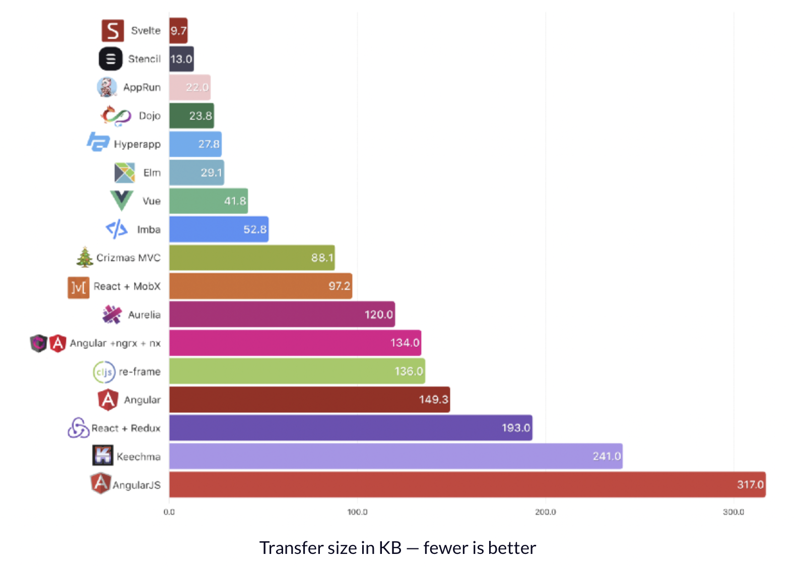
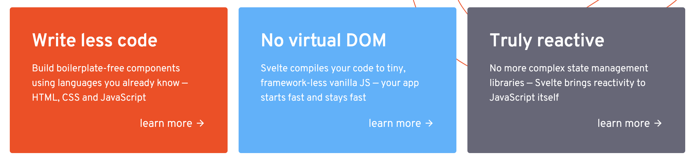

### Who are you Svelte?

> *Cybernetically enhanced web apps*

Svelte는 웹 어플리케이션을 개발할 때 사용할 수 있는 또 하나의 JS 프레임워크입니다. 
*Cybernetically enhanced web apps*라는 슬로건을 공식 홈페이지에 내걸고 있습니다. 
과연 얼마나 발전했는지 차근차근 알아보겠습니다.

### Svelte가 주목받는 이유

도대체 어떤 이유에서 svelte가 새로운 Javascript 프레임워크로 주목받고 있는 걸까요? 
*A RealWorld Comparison of Front-End Frameworks with Benchmarks (2019 update)*에 따르면 
Svelte는 다른 프레임워크에 비해 번들 사이즈에 장점이 있는 것으로 보입니다.

아래 차트는 순수히 번들된 Javascript 파일의 용량을 비교한 결과입니다. 
(이 프로젝트에서는 서로 다른 프레임워크를 이용해 RealWorld application을 개발한 뒤 그 성능을 비교하였습니다.)



번들된 Javascript 파일의 크기가 작을수록 네트워크를 이용해 다운로드 받는 시간이 적게 걸리며 브라우저가 interpret할 작업량도 적어질 것은 자명합니다. 
(로딩시간에 대한 사용자 임계치에 따라 다를 수 있지만) 사용자 경험을 개선할 수 있다는 점도 분명해 보입니다.

### Svelte의 특징

[Svelte official page](https://svelte.dev/)에서 소개하는 특징(장점)은 다음과 같습니다.



#### Write less code

많은 line의 코드를 작성하지 않고도 원하는 동작을 충분히 구현해 내는 것은 모든 개발자들이 꿈꾸는 이상과도 같을 것 입니다.(코드 가독성이 보존된다는 전제하에) 
이런 특징에서 Svelte는 [Developer Experience도 충분히 고려](https://blog.scottlogic.com/2021/01/18/philosophy-of-svelte.html)했다고 보여집니다.

React-redux application 개발자로서 애로사항을 느꼈던 부분 중 하나가 boilerplate 코드가 많이 양산된다는 점인데요.
Typescript를 이용해 개발하는 경우 action, reducer state의 type을 명시하는 코드가 더 필요하게 됩니다.

아래 section에서도 다루지만 Svelte가 내장하고 있는 store의 경우,
적은 boilerplate 코드로도 Application의 state를 업데이트 할 수 있도록 구현되어 있습니다.

[svelte blog](https://svelte.dev/blog/write-less-code)에 있는 두 개의 input에서 받은 숫자의 합을 출력하는 간단한 예제를 가져왔습니다.
React에서는 아래와 같이 `useState` hook을 사용해서 state를 update하는 방식을 제공합니다.

```jsx
import React, { useState } from 'react';

export default () => {
  const [a, setA] = useState(1);
  const [b, setB] = useState(2);

  function handleChangeA(event) {
    setA(+event.target.value);
  }

  function handleChangeB(event) {
    setB(+event.target.value);
  }

  return (
    <div>
      <input type="number" value={a} onChange={handleChangeA}/>
      <input type="number" value={b} onChange={handleChangeB}/>

      <p>{a} + {b} = {a + b}</p>
    </div>
  );
};
```

반면, Svelte는 input element에 각 state를 bind 시켜 같은 동작을 inline으로 처리할 수 있는 방식을 제공합니다.
매우 간편해보이죠? bind directive와 two-way binding에 대해서는 아래서 자세히 이야기해 볼 예정입니다.

```svelte
<script>
	let a = 1;
	let b = 2;
</script>

<input type="number" bind:value={a}>
<input type="number" bind:value={b}>

<p>{a} + {b} = {a + b}</p>
```

#### No virtual DOM

기존 Javascript 프레임워크(React, Vue)들은 개발자가 declarative code를 작성하면 
[virtual DOM diffing](https://svelte.dev/blog/virtual-dom-is-pure-overhead)을 이용해 DOM을 업데이트하는 방식을 사용했습니다. 
이 방식은 브라우저가 DOM을 업데이트 하기 전에 부가적인 일을 시키기 때문에 frame을 잡아먹고 garbage collector에 영향을 주게 됩니다.

반면 Svelte는 build time에 작성한 컴포넌트들을 imperative code로 변환함으로서 DOM을 즉각 업데이트 할 수 있도록 합니다. 
Rich Harris에 따르면 Rust와 WASM으로 개발된 어플리케이션보다도 속도 측면에서 더 높은 성능을 보여준다고 합니다.

<YouTube youTubeId="AdNJ3fydeao" skipTo={{ m: 23, s: 37 }}/>

#### Truly reactive

React의 경우 다양한 state management library들이 존재합니다. 
Redux부터 MobX, Recoil, Zustand 등 라이브러리를 선택하는 것 조차 일이 되어버렸죠. 
Svelte는 상태관리 util(store)을 내장하고 있기 때문에 이런 고민을 할 필요가 없습니다.
( `$` 기호를 이용해 스토어를 subscribe 할 수 있는 기능까지도 제공합니다.)

### 잠시만, Two-way data binding 이라고?

Svelte는 top down의 data flow를 기본으로 합니다. 
부모 컴포넌트가 자식 컴포넌트의 props을 set할 수 있으며, 컴포넌트가 HTML Element의 속성을 set 할 수 있는 구조입니다.

그러나, 때에 따라 bottom-up으로 data를 변경할 수 있으면 편한 경우가 있습니다.
예를 들어 `<input>` element의 입력값에 따라 name이라는 변수를 업데이트하고 싶다고 합시다.

아래의 react code snippet에서 볼 수 있듯이, 
One-way binding일 때는 상태를 가지고 있는 부모 컴포넌트에서 onChange라는 이벤트 핸들러를 만든 다음, child 컴포넌트에 넘겨주어 상태를 업데이트하도록 합니다. 
구조적으로는 단단해지지만 상태를 관리하는 컴포넌트에서 항상 이벤트 핸들러를 만들어 내려주는 boilerplate 코드가 자연스럽게 증가하게 됩니다.

```tsx
// child
const MyInput = ({ onChange }) => (
	<input placeholder="enter your name" onChange={onChange}/>
)

// parent
const IntroductionPage = () => {
	const [name, setName] = useState('');
	const onChange = (e: ChangeEvent<HTMLInputElement>) => setName(e.target.value)

	return (
		<div>
			<MyInput onChange={onChange}/>
			<h1>Hello, my name is {name}</h1>
		</div>
	)
}
```

한편, Svelte는 data를 two-way binding하여 boilerplate 코드를 제거할 수 있는 bind directive를 제공합니다. 
같은 동작을 inline 코드로 가능하도록 함으로써 write less를 추구하고 있습니다.

```svelte
<script>
	let name = 'Jason';
</script>

<input placeholder="enter your name" bind:value={name}>
<h1>Hello, my name is {name}</h1>
```

two-way binding의 편의성과 견고함에 대한 논쟁은 이어지고 있습니다. 
Svelte가 제공하는 bind directive와 같이 two-way binding이 작성해야 하는 코드를 줄이고 편한 것은 사실이지만 
확장성이 있느냐(큰 규모의 application을 개발하기에 무리가 없는가) 하는 문제입니다.

어플리케이션의 규모가 커짐에 따라 컴포넌트 트리는 깊고 복잡해지기 마련입니다. 
이 때 binding된 data가 여러 컴포넌트에서 동시에 사용되고 있는 경우 그것을 모두 추적하려면 큰 노력이 따를 것입니다. 
그렇기 때문에 혹자는 svelte가 small-medium size 어플리케이션을 targeting 한 것 아니냐는 이야기를 하기도 합니다.

[Why two-way binding isn't bad...](https://github.com/sveltejs/svelte/issues/4403) 스레드에서는 
React를 주로 사용하던 개발자가 two-way binding이 나쁘지만은 않은 이유에 대해 주장하고 있습니다. 
그는 컴포넌트 트리에서 너무 멀리 떨어져있는 컴포넌트에 data를 binding하지 않는 이상 less code가 주는 가치가 더 크다고 말합니다. 
코드가 짧을 수록 유지 보수에 사용되는 시간과 노력을 절감할 수 있다는 논리이죠. 

two-way binding의 확장성과 복잡성의 문제를 해결하는 것이 one-way binding인 flux architecture라고 생각합니다. 
그래서 개인적으로는 개발 편의성을 제공하는 svelte보다는 안정성을 보장하는 견고한 react에 마음이 갑니다.

### Conclusion

*Cybernetically enhanced web apps*라는 svelte를 한 줄 요약해보자면 
'Typescript로 구현된 web app 컴파일러' 정도가 될 것 같습니다. 
첫 인상은 하나의 파일에 markup, style, script가 모두 녹아있어 겉모습이 Vue와 매우 닮았다는 생각을 했습니다. 

그러나, Svelte를 이용해 small size web app을 개발하면서 그 철학을 천천히 알아가면서는 
현재 인기있는 React나 Vue와는 사뭇 다른 기조를 가지고 있음을 느끼게 되었습니다. 
다만 **혁신적이다**라는 느낌까지는 받지 못했던 것 같습니다.


항상 새로운 것에 이끌리는 인간의 본성 때문인지 개인적으로 새로운 Javascript 프레임워크(Svelte)가 첫 눈에는 매력적으로 보여졌습니다.
빠른 시일내에 React나 Vue의 아성을 무너뜨리기는 어려워 보이기는 하지만, 
NextJS style의 프레임워크인 [Svelte kit](https://kit.svelte.dev/)이 어떻게 
(web app을 쉽게 개발할 수 있도록)발전하는지는 주목해 볼만하다고 여겨집니다.
